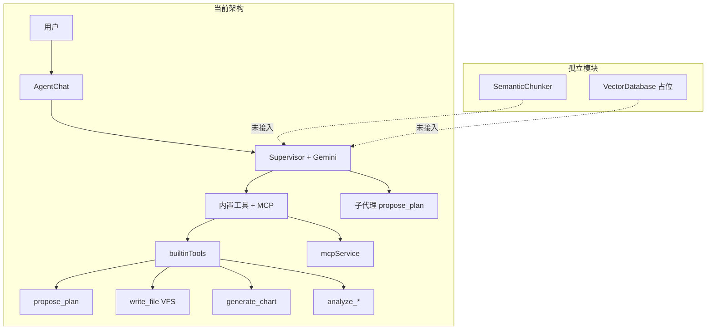
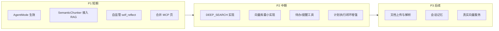

# 自监管智能办公助手开发计划

## 一、现状概览

**核心能力**：Supervisor 编排、计划提议与审批、工具调用（内置 + MCP）、思考过程可视化、VFS 写入、图表生成。

**主要缺口**：

- `AgentMode.DEEP_SEARCH` 仅存在于 `types.ts` 和 UI 选择器，**未在逻辑中生效**
- `VectorDatabase` 为**静态占位**，无真实向量检索
- `SemanticChunker` 与对话**未打通**，分块结果无法作为 RAG 上下文
- MCP 页（`mcp` tab）为**占位 UI**，实际 MCP 管理在 `tools` 页
- 无自检、自纠、反思等**自监管**能力

---

## 二、增强现有功能

### 2.1 让 AgentMode 真正影响行为

**现状**：`mode` 传入 `AgentChat` 和 `ChatHeader`，仅用于展示，`geminiService.supervisorAgent` 未使用。

**改进**：

- 在 [services/geminiService.ts](services/geminiService.ts) 中增加 `mode` 参数
- **TRADITIONAL**：禁用 `propose_plan`，单轮直接执行，减少工具调用
- **AGENTIC**：保持现有逻辑
- **DEEP_SEARCH**：启用深度检索模式（见 3.2）

### 2.2 计划与执行闭环

**现状**：`propose_plan` 生成计划后，用户批准/修改，但：

- 步骤执行状态（`status: pending/in_progress/completed`）仅部分更新
- 无步骤级回滚或重试
- 计划折叠后不易追踪进度

**改进**：

- 在 [components/chat/PlanView.tsx](components/chat/PlanView.tsx) 中展示每步 `status` 与进度
- 支持「单步重试」：对失败步骤重新发起工具调用
- 计划执行完成后提供「总结」或「导出为待办」的快捷操作

### 2.3 工具能力与 MCP 接入体验

**现状**：MCP 工具通过 `mcp_<serverId>__<toolName>` 注册，名称冗长；工具管理页与 MCP 连接分散。

**改进**：

- 在 [components/tools/ToolsManagerPage.tsx](components/tools/ToolsManagerPage.tsx) 中为 MCP 工具增加「别名」或「分组」展示
- 将 MCP 页（`mcp` tab）整合为工具管理页的「MCP 连接」子视图，或直接跳转到工具管理页的 MCP 区域
- 在 Supervisor 提示词中增加「优先使用已连接 MCP 工具」的指引（当 MCP 已连接时）

### 2.4 行业与角色配置

**现状**：`Industry` 和 `AgentRoleConfig` 已支持，但行业选择对提示词影响有限。

**改进**：

- 在 [services/prompts.ts](services/prompts.ts) 中为各行业补充更具体的领域规则（法律合规、金融财务、技术研发）
- 支持用户自定义「角色预设」并持久化（如「法务助手」「财务分析师」），可从侧边栏或设置中切换

---

## 三、补齐缺失实现

### 3.1 打通 SemanticChunker 与对话 RAG

**现状**：`SemanticChunker` 独立运行，分块结果不进入对话上下文。

**设计**：

- 在 [services/agentStateService.ts](services/agentStateService.ts) 中增加「知识库」状态：`knowledgeChunks: { sessionId → SemanticChunk[] }`
- 新增内置工具 `search_knowledge`：根据用户问题检索相关 chunks（先用简单关键词/语义匹配，后期接向量）
- 在「语义切片引擎」页增加「导入到当前会话」操作，将分块结果写入 `knowledgeChunks`
- Supervisor 在涉及文档/长文本问题时，自动调用 `search_knowledge`

### 3.2 实现 DEEP_SEARCH 模式

**现状**：`DEEP_SEARCH` 枚举存在但无实现。

**设计**：

- 当 `mode === DEEP_SEARCH` 时，在 [services/geminiService.ts](services/geminiService.ts) 中注入额外系统指令：
  - 要求「多轮检索、汇总、交叉验证」
  - 明确使用 `analyze_data`、`search_knowledge`（若有）、MCP 检索类工具
  - 增加 `thinkingBudget`，鼓励更长的推理链
- 可选：增加 `search_web` 或接入 MCP 检索工具（如 context7）作为外部信息源

### 3.3 向量库从占位到可用的最小实现

**现状**：`VectorDatabase` 为静态 UI 占位。

**设计（分阶段）**：

**Phase 1（短期）**：

- 将 [components/VectorDatabase.tsx](components/VectorDatabase.tsx) 与 `SemanticChunker` 打通：分块结果可「导入向量库」
- 向量库以「内存 + 简单全文索引」实现：chunks 存于 `localStorage`，检索用 `String.includes` 或简单 TF-IDF 风格匹配
- 提供「测试语义检索」输入框，返回匹配 chunks 列表

**Phase 2（中期）**：接入真实向量服务（如 Gemini Embedding API、或自建向量库），替换内存实现。

### 3.4 合并 MCP 页与工具管理

**现状**：`mcp` tab 展示占位内容；实际 MCP 连接在 `tools` 页。

**改进**：

- 将 [App.tsx](App.tsx) 中 `mcp` 的 `renderContent` 改为重定向到 `tools` 并高亮 MCP 区域，或直接移除 `mcp` 入口，在 Sidebar 只保留「工具管理」
- 在工具管理页顶部增加 Tab：「内置工具 | MCP 连接 | 已注册工具」，统一入口

---

## 四、新增能力

### 4.1 自监管：反思与自检

**目标**：让 Agent 在关键节点进行自我检查。

**方案**：

- 新增内置工具 `self_reflect`：接收「当前输出摘要 + 用户需求」，返回「是否满足、遗漏点、改进建议」的 JSON
- 在 `write_file` 或多步骤计划执行完成后，Supervisor 可选调用 `self_reflect`，根据结果决定是否补充或重试
- 在 [services/prompts.ts](services/prompts.ts) 中增加规则：「对写操作、多步骤任务，执行后调用 self_reflect 做简要自检」

### 4.2 自监管：质量门禁与自动重试

**方案**：

- 为 `write_file` 增加「基础校验」：如代码文件检查语法（通过 lightweight 解析或调用 MCP），文档检查基本格式
- 校验失败时，将错误信息反馈给 Supervisor，触发一次「修复」重试
- 可配置：重试次数上限、是否对用户可见

### 4.3 办公场景：待办与提醒

**方案**：

- 新增内置工具 `create_reminder` / `create_todo`：参数为 `title`、`dueAt`（可选）、`priority`
- 数据存于 `localStorage`（或通过 MCP 对接外部待办服务）
- 新增 Sidebar 入口或 dashboard 组件：「今日待办」列表，支持勾选完成
- Supervisor 在会话中可创建、查询、完成待办

### 4.4 办公场景：会话记忆与上下文

**方案**：

- 在 [services/agentStateService.ts](services/agentStateService.ts) 中增加「会话摘要」：每 N 轮对话后，用 Gemini 生成简短摘要，写入 `sessionSummary`
- 新对话开始时，将 `sessionSummary` 注入 system 或首条 user 消息，实现跨轮记忆
- 可选：增加「关键事实」提取，持久化到用户级存储，供多会话复用

### 4.5 文档解析与上传

**方案**：

- 新增「上传文档」入口（支持 txt、md、pdf 文本提取），内容进入 `SemanticChunker` 或直接存入知识库
- 新增内置工具 `read_uploaded_doc`：根据 docId 返回内容片段，供 Supervisor 检索
- 为后续「合同分析」「会议纪要」等场景打基础

---

## 五、实施优先级建议

| 优先级 | 任务                     | 预期收益      |
| --- | ---------------------- | --------- |
| P1  | AgentMode 行为分化         | 模式选择有实际意义 |
| P1  | 知识库 + search_knowledge | 文档能力进入对话  |
| P1  | self_reflect 自检工具      | 自监管第一步    |
| P1  | MCP 页与工具管理整合           | 体验统一      |
| P2  | DEEP_SEARCH 实现         | 深度检索场景可用  |
| P2  | 向量库最小实现                | 知识检索可验证   |
| P2  | 待办/提醒                  | 办公助手雏形    |
| P2  | 计划执行闭环                 | 多步骤任务可追踪  |
| P3  | 文档上传、会话记忆、真实向量         | 完整办公助手能力  |

---

## 六、技术依赖与风险

- **Gemini API**：`self_reflect`、会话摘要、embedding 均依赖 API，需考虑配额与延迟
- **向量实现**：Phase 1 不依赖外部服务；Phase 2 可选择 Gemini Embedding 或 Supabase/向量库
- **MCP 稳定性**：本地 MCP 需手动启动，建议在工具页增加「连接状态」与「一键启动脚本」提示

---

## 七、关键文件索引

| 模块      | 文件                                                                             |
| ------- | ------------------------------------------------------------------------------ |
| 核心编排    | [services/geminiService.ts](services/geminiService.ts)                         |
| 提示词     | [services/prompts.ts](services/prompts.ts)                                     |
| 内置工具    | [services/builtinTools.ts](services/builtinTools.ts)                           |
| 状态管理    | [services/agentStateService.ts](services/agentStateService.ts)                 |
| 计划 UI   | [components/chat/PlanView.tsx](components/chat/PlanView.tsx)                   |
| 工具/MCP  | [components/tools/ToolsManagerPage.tsx](components/tools/ToolsManagerPage.tsx) |
| 语义分块    | [components/SemanticChunker.tsx](components/SemanticChunker.tsx)               |
| 向量库     | [components/VectorDatabase.tsx](components/VectorDatabase.tsx)                 |
| 路由与 Tab | [App.tsx](App.tsx)                                                             |

